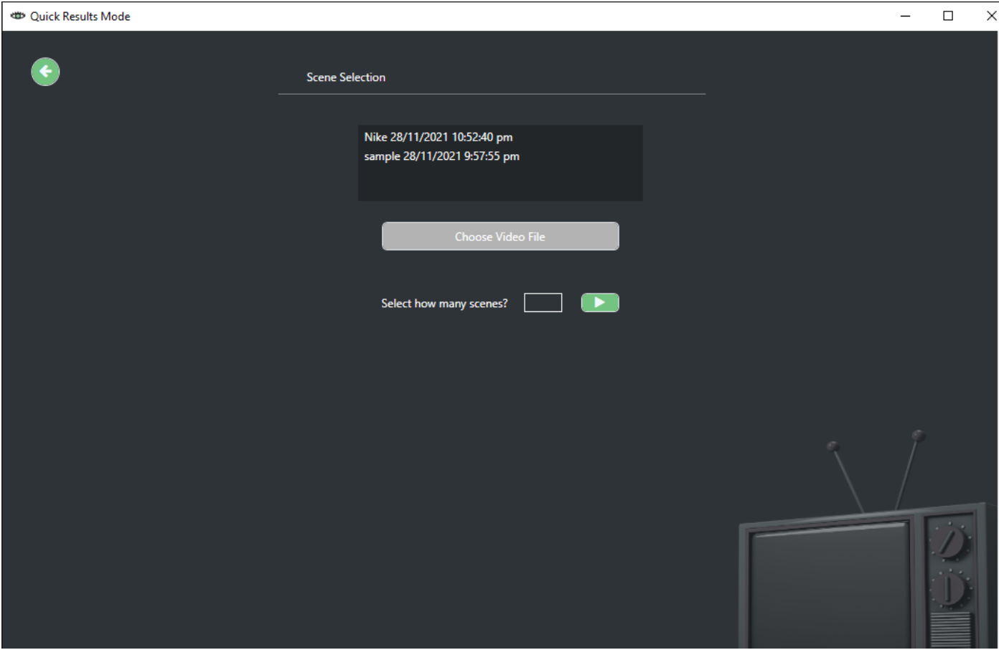
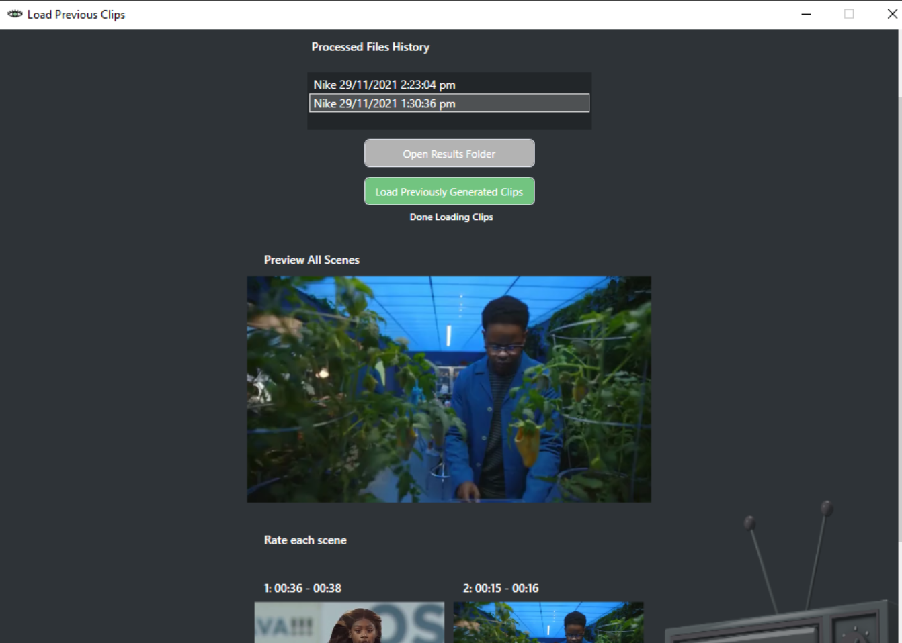

## Eye Luminate
Eye Luminate determines the most eye-catching scenes of TV commercials based on the user’s eye movement. It’s a Windows desktop application that uses a web camera to capture eye data from the user.

## Screenshots

## Installation
1. Install Python
    * Get any version of [Python 3.x](https://www.python.org/downloads/)

2. Install Python dependencies
    * Download **requirements.txt** from ./setup
    or [here](bit.ly/EL-reqs)
    * Install requirements.txt through bash/commandline
        <pre><code>pip install requirements.txt</code></pre>
    ** See [pip documentation](https://pip.pypa.io/en/stable/installation/) if needed

3. Install [GazePointer](https://gazerecorder.com/gazepointer/)

4. Install Eye Luminate (setup.exe)

## Credits
This is a capstone project made by [Tim](https://github.com/timzcodes), [Lulu](https://github.com/llw4h), [Bea](https://github.com/beatrs), and Ryan.
